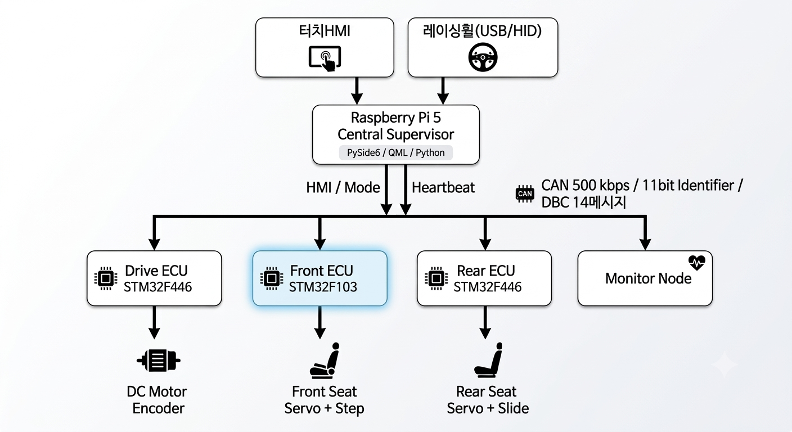
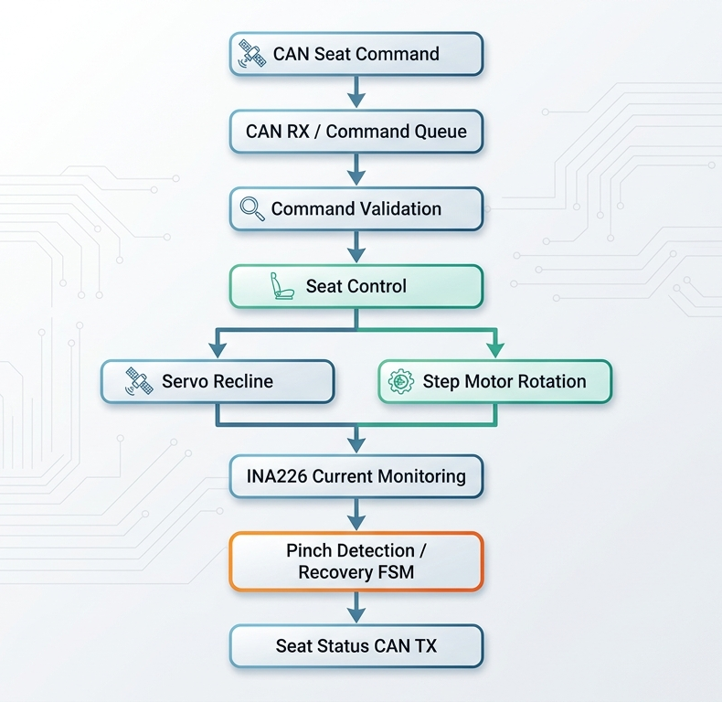
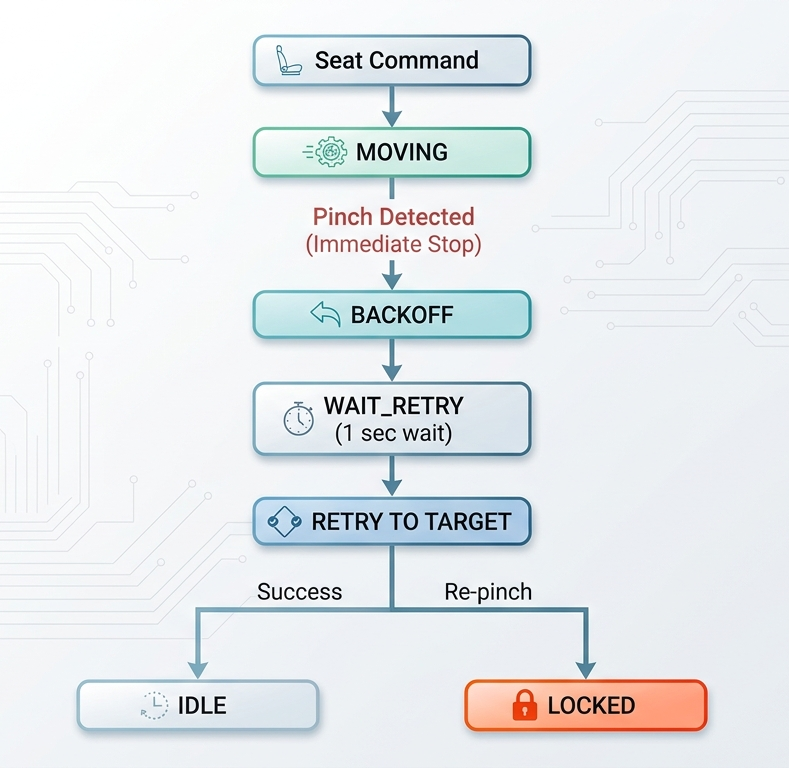
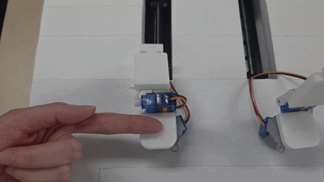

# 🚗 CAN 기반 PBV Cabin 분산 제어 시스템
> **최종 프로젝트 경진대회 대상**

- **개발 기간**: 2026.06.17 ~ 2026.07.09
- **개발 인원**: 5명
- **담당 역할**: Front Zone ECU 펌웨어 설계 및 구현 / 하드웨어 통합 및 동작 검증

---

## 📌 프로젝트 개요

### 전체 시스템

Raspberry Pi 5 기반 **Central Supervisor**와 STM32 기반 분산 ECU (**Drive / Front / Rear**)를 **500 kbps CAN 네트워크**로 연결하여 주행 제어, 4개 좌석 자세 제어, Cabin Mode 전환 및 비상정지 기능을 통합 관리하는 **PBV 실내 분산 제어 시스템**.


### Front Zone ECU 역할

상위 Supervisor의 좌석 제어 명령을 수신하여 앞좌석(운전석/조수석)의 **Recline 및 Rotation 제어**를 수행하고 INA226 전류 센서를 이용한 실시간 전류 측정을 기반으로 **끼임 방지 안전 로직**과 **비상 정지 기능**을 수행하도록 구현.

---

## 🏗️ System Architecture

<!-- ============================= -->
<!-- 이미지 1: 전체 시스템 구조도 -->
<!-- 추천 파일명: assets/system_architecture.png -->
<!-- ============================= -->



> **담당 영역:** Front Zone ECU

---

## 🛠️ 사용 기술 및 개발 환경

### 전체 시스템

`Raspberry Pi 5` · `STM32F103/F439/F446` · `CAN 500 kbps` · `DBC` · `Python` · `QML` · `PySide6` · `FreeRTOS`

### 담당 개발

`STM32F103` · `C` · `STM32CubeIDE` · `STM32 HAL` · `CAN Bus` · `I2C` · `INA226` · `PWM` · `Servo Motor` · `Step Motor`

---

## ⚙️ 프로젝트 핵심 기능

- **CAN 기반 분산 ECU Command / Status 제어**
- **Gear 상태 기반 Seat / Drive Interlock**
- **Cabin Mode 기반 다중 좌석 ECU 통합 제어**
- **CAN Status 기반 3D Digital Twin HMI**
- **Heartbeat / SafeAbort 기반 System Fail-safe**
- **전류 기반 Seat Anti-Pinch 안전 제어**

---

## 🌟 담당 역할

- STM32F103 기반 **Front Zone ECU 펌웨어 설계 및 구현**
- CAN 기반 운전석·조수석 **Recline / Rotation 명령 수신 및 Status 송신**
- Servo PWM 및 Step Motor 기반 **좌석 구동 로직 구현**
- INA226 전류 측정 기반 **Anti-Pinch 판단 및 Recovery FSM 구현**
- SafeAbort 수신 시 **Front Seat 구동 즉시 정지 로직 구현**
- 메인 제어기·감시 노드·ECU·구동부 **통합 배선 및 CAN 동작 검증**

---

## 🔧 Front Zone ECU 구조

<!-- ================================ -->
<!-- 이미지 2: Front Zone ECU 구조도 -->
<!-- 추천 파일명: assets/front_ecu_architecture.png -->
<!-- ================================ -->

<p align="center">
  
</p>

---

# 💻 핵심 구현

## 1. CAN ISR과 Application Logic 분리

### CAN Interrupt 분리

CAN RX Interrupt에서는 수신된 Frame을 Decode하고  
Command Queue에 저장하는 최소한의 작업만 수행하도록 구성했습니다.

실제 좌석 구동이나 복잡한 안전 판단을 ISR 내부에서 수행하지 않아  
Interrupt 처리 시간이 길어지는 것을 방지했습니다.

```text
CAN RX Interrupt
       ↓
Frame Decode
       ↓
Command Queue
       ↓
ISR Return
```

### Main Loop 독립 처리

실제 좌석 명령 검증과 액추에이터 제어는 메인 루프의

`FrontSeatApp_Process()`

에서 수행하도록 분리했습니다.

이를 통해 Servo 및 Step Motor가 동작하는 동안에도

- CAN 메시지 처리
- Pinch Detection
- SafeAbort 처리
- Status 송신

등의 기능을 지속적으로 수행할 수 있도록 구성했습니다.

```text
while (1)
{
    FrontSeatApp_Process();
}
```

---

## 2. Non-blocking 기반 점진적 모션 제어

### Servo Motor - `Servo_Process()`

목표 PWM 값을 한 번에 적용하지 않고  
**10 ms 주기로 PWM Pulse Width를 단계적으로 변경**하도록 구현했습니다.

이를 통해 목표각 변경 시 발생하는 급격한 서보 동작을 완화하면서도  
모터 동작 중 다른 Application Logic이 계속 실행될 수 있도록 했습니다.

```text
Target Angle 설정
       ↓
10 ms 주기
       ↓
PWM Pulse 단계적 변경
       ↓
Target Angle 도달
```

### Step Motor - `Step_Process()`

절대 위치 센서가 없는 Step Motor 특성을 고려하여

- 부팅 시 Software 기준 위치 설정
- Rotation Angle ↔ Step Count 변환
- 구동한 Step 수를 Software에서 누적

하는 방식으로 좌석 Rotation 상태를 관리했습니다.

Blocking 방식으로 목표 위치까지 한 번에 구동하지 않고  
`Step_Process()` 호출마다 필요한 Step을 순차적으로 수행하도록 구현했습니다.

> ⚠️ 실제 Encoder Feedback 기반의 위치 측정이 아닌  
> **Open-loop Step Count 기반 Software Position 관리 방식**입니다.

---

## 3. 이중 과전류 기반 Anti-Pinch Detection

INA226 전류 센서를 이용하여 Recline Servo의 부하 전류를 주기적으로 측정하고,  
정상 구동과 끼임 상태를 구분하도록 구현했습니다.

### Inrush Current 예외 처리

모터 구동 직후에는 정상 상태에서도 순간적으로 높은 기동 전류가 발생합니다.

따라서 `PINCH_START_IGNORE_MS` 동안은 끼임 판단을 유예하여  
기동 전류에 의한 False Detection을 방지했습니다.

```text
Motor Start
    ↓
Inrush Ignore Time
    ↓
Pinch Detection 활성화
```

### Soft / Hard Threshold

하나의 임계값만 사용하는 대신 두 가지 판정 조건을 사용했습니다.

#### Hard Condition

순간적으로 매우 높은 전류가 연속적으로 발생하는 경우  
급격한 부하 또는 끼임으로 판단합니다.

#### Soft Condition

상대적으로 낮지만 지속적으로 증가한 부하를 검출하기 위해  
좌석별 튜닝 조건에 따라 **순간값 또는 Moving Average**를 이용합니다.

### Consecutive Counter

일시적인 전류 Peak나 Noise만으로 끼임이 판단되지 않도록

- `soft_count`
- `hard_count`

를 이용하여 **일정 횟수 이상 연속으로 임계값을 초과한 경우에만**  
Pinch Event가 발생하도록 구성했습니다.

---

## 4. FSM 기반 Pinch Recovery

끼임 발생 시 단순 정지에서 끝나는 것이 아니라  
압력을 해제하고 안전하게 복구하기 위한 상태 기반 제어를 구현했습니다.

<!-- ============================== -->
<!-- 이미지 3: Pinch Recovery FSM -->
<!-- 추천 파일명: assets/pinch_fsm.png -->
<!-- ============================== -->

<p align="center">
  
</p>


FSM 상태는 다음과 같이 구성했습니다.

```text
MOVING -> BACKOFF -> WAIT_RETRY -> RETRY_TO_TARGET -> IDLE / LOCKED
```

### Recovery Logic

1. 끼임 감지
2. 현재 좌석 구동 즉시 정지
3. 반대 방향으로 일정 각도 Backoff
4. 일정 시간 대기
5. 기존 Target Position으로 1회 재시도
6. 재끼임 발생 시 `LOCKED` 상태로 전환

또한 Backoff 동작 중 발생하는 역방향 구동 전류가  
다시 끼임으로 판정되는 것을 막기 위해

`PinchDetect_Suspend()`

기능을 적용하여 회피 동작 중 Pinch Detection을 일시적으로 유예했습니다.



---

## 5. SafeAbort 기반 비상정지

시스템 비상 상황에서 일반 좌석 명령보다  
**SafeAbort 메시지를 우선 처리**하도록 구현했습니다.

```text
SafeAbort (CAN ID 0x010)
          ↓
Front ECU 수신
          ↓
Servo / Step Motor Stop
          ↓
Control FSM Reset
          ↓
일반 Seat Command 차단
```

Supervisor / Monitor에서 전송한

`SafeAbort (0x010)`

메시지를 수신하면

- Servo 즉시 정지
- Step Motor 즉시 정지
- 진행 중인 Seat Control FSM 초기화
- SafeAbort 상태 동안 신규 Seat Command 무시

하도록 구현했습니다.

<!-- ================================= -->
<!-- 이미지 4: SafeAbort 테스트 사진/영상 GIF -->
<!-- 추천 파일명: assets/safe_abort_test.gif -->
<!-- ================================= -->


---

# 💡 주요 문제 해결 및 고찰

## 1. 서보 모터 목표각 즉시 적용 시 급격한 동작 개선

### 문제

목표 PWM Pulse Width를 한 번에 변경할 경우  
Servo가 목표 위치 방향으로 급격하게 동작하는 문제가 있었습니다.

### 해결

`SERVO_UPDATE_MS` 주기로 PWM Pulse Width를 단계적으로 갱신하는  
**Non-blocking Software Ramp 방식**을 적용했습니다.

이를 통해 좌석 구동을 점진적으로 수행하면서도  
CAN 및 안전 로직을 동시에 처리할 수 있도록 개선했습니다.

---

## 2. 기동 전류 및 Noise에 의한 Anti-Pinch 오검출 개선

### 문제

모터 초기 구동 시 발생하는 Inrush Current와 순간적인 Current Peak 때문에  
정상 구동 상태를 끼임으로 잘못 판단하는 False Stop이 발생했습니다.

### 분석

정상 / 역방향 / 끼임 조건에서 INA226 전류 값을 비교하고  
동작 구간별 전류 변화 특성을 확인했습니다.

<!-- ==================================== -->
<!-- 이미지 5: 정상/끼임 전류 비교 그래프 -->
<!-- 추천 파일명: assets/pinch_current_analysis.png -->
<!-- ==================================== -->


### 해결

다음 조건을 조합하여 판정 로직을 개선했습니다.

- 초기 기동 구간 판단 제외 (`start_ignore_ms`)
- Soft / Hard Threshold 분리
- Moving Average 적용
- 연속 Threshold 초과 횟수 확인
- 좌석별 Threshold 및 Detection Count 개별 조정

이를 통해 순간적인 전류 Peak에 의한 오검출을 줄이고  
실제 부하가 지속되는 상황을 구분할 수 있도록 개선했습니다.

---

## 3. Pinch Backoff 중 재감지 Loop 해결

### 문제

끼임을 감지한 뒤 반대 방향으로 Backoff하는 과정에서도  
Servo 구동 전류가 발생하기 때문에 해당 전류가 다시 끼임으로 판단되는 문제가 있었습니다.

```text
Pinch
 ↓
Backoff
 ↓
Current 증가
 ↓
Pinch 재감지
 ↓
Recovery 반복
```

### 해결

Backoff 구간에서는

`PinchDetect_Suspend()`

를 통해 Anti-Pinch 판정을 일시적으로 유예하도록 수정했습니다.

```text
Pinch
 ↓
Detection Suspend
 ↓
Backoff
 ↓
Detection Resume
 ↓
Retry
```

이를 통해 회피 동작 중 발생하는 역방향 구동 전류에 의한  
반복 Recovery Loop를 방지했습니다.

---

## 4. 다중 ECU CAN Network 통합 문제 해결

### 문제

Front / Rear / Drive / Supervisor / Monitor 등 여러 노드를  
하나의 CAN Network에 통합하는 과정에서 통신 불안정이 발생했습니다.

### 점검

- ECU별 단독 CAN 송·수신 확인
- CAN-H / CAN-L 배선 확인
- 공통 GND 확인
- 각 Node 단계별 Network 추가
- CAN 종단저항 상태 확인

### 해결

CAN Network 양단의 종단 조건을 점검하고 부족한 종단저항을 보완한 뒤,  
ECU를 하나씩 추가하는 방식으로 단계적 통합 검증을 수행했습니다.

이를 통해 **500 kbps CAN Network의 전체 Node 통신 동작을 검증**했습니다.

<!-- ================================= -->
<!-- 이미지 6: 실제 CAN 네트워크 HW 사진 -->
<!-- 추천 파일명: assets/can_network_hardware.jpg -->
<!-- ================================= -->


---

## 5. Sensorless Step Motor 제어의 한계 및 개선 방향

### 현재 구조

Front Seat Rotation Step Motor는 Encoder 또는 Absolute Position Sensor 없이  
명령한 Step Count를 Software에서 누적하여 현재 위치를 관리합니다.

따라서 다음과 같은 구조적 한계가 있습니다.

- 전원 재부팅 시 실제 절대 위치 확인 불가
- 외부 하중에 의한 Step-out 발생 시 Software 위치와 실제 위치 차이 발생 가능
- 수동으로 좌석 위치가 변경될 경우 오차 확인 불가

### 개선 방향

양산 또는 실제 차량 수준으로 확장한다면 다음과 같은 구조가 필요합니다.

- Absolute Encoder 또는 Hall Sensor 기반 위치 Feedback
- Limit Switch 등을 이용한 Physical Homing
- 전원 인가 시 Reference Position Calibration
- Position Feedback 기반 Closed-loop Control

현재 프로젝트에서는 Step Count 기반 제어를 사용했지만,  
실제 시스템 적용 시에는 **독립적인 위치 센서를 추가하여 Software Position과 실제 물리 위치를 검증하는 구조가 필요**하다고 판단했습니다.

---

# 🧪 Integration & Validation

Front ECU 단위 기능뿐만 아니라 실제 차량 모형의 전체 ECU를 연결하여  
통합 동작을 검증했습니다.

- 운전석 / 조수석 Recline 및 Rotation 독립 제어
- CAN Command 수신 및 Seat Status 송신 확인
- Gear / Cabin Mode 조건에 따른 Seat Command 동작 확인
- INA226 기반 정상 / 부하 / 끼임 전류 측정 및 조건 튜닝
- SafeAbort 수신 시 Front Seat 즉시 정지 확인
- 감시 노드 통신 이상 상황을 구성하여 비상정지 동작 검증
- 다중 ECU CAN Network 단계적 통합 및 종단저항 점검

<!-- =============================== -->
<!-- 이미지 7: 최종 프로젝트 전체 HW -->
<!-- 추천 파일명: assets/final_hardware.jpg -->
<!-- =============================== -->


---

# 🎬 Demo

<!-- ================================== -->
<!-- 이미지 8: 최종 시연 GIF 또는 영상 Thumbnail -->
<!-- 추천 파일명: assets/demo.gif -->
<!-- ================================== -->


> 최종 프로젝트 시연 영상 또는 주요 동작 GIF 삽입 예정
