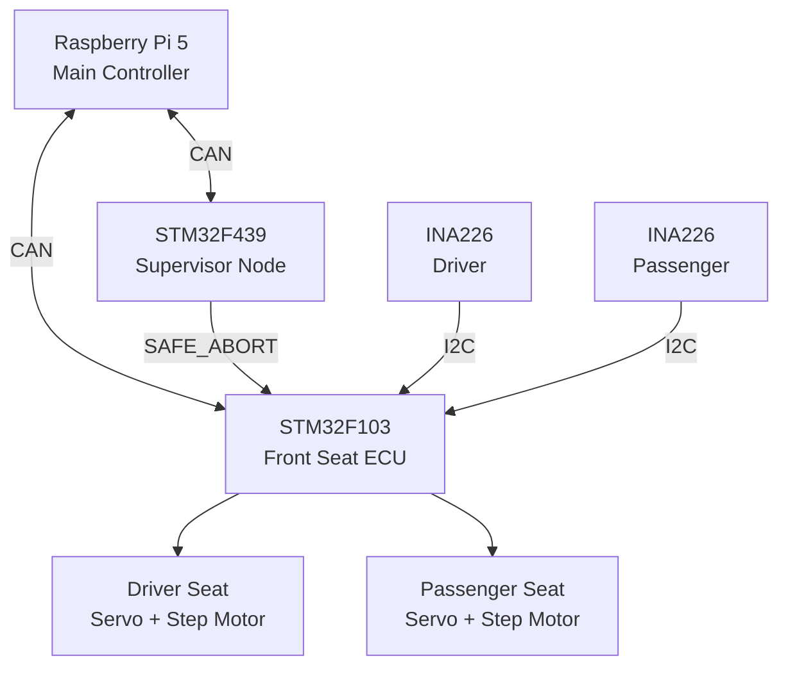
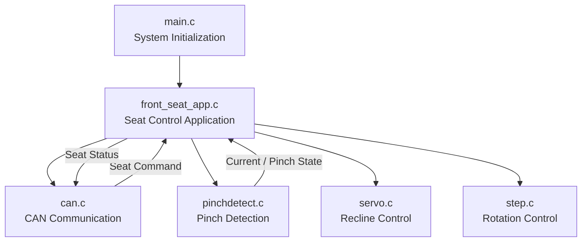
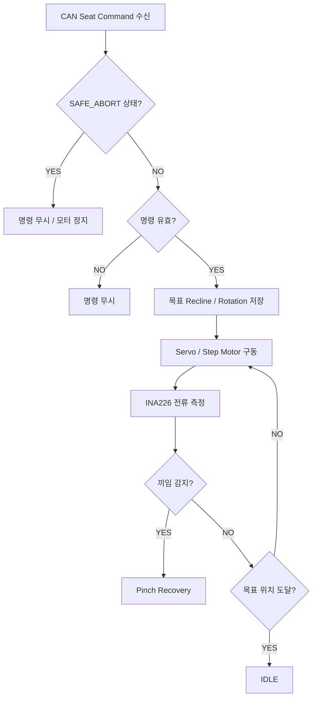
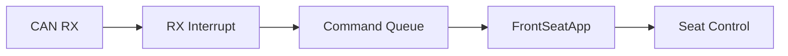
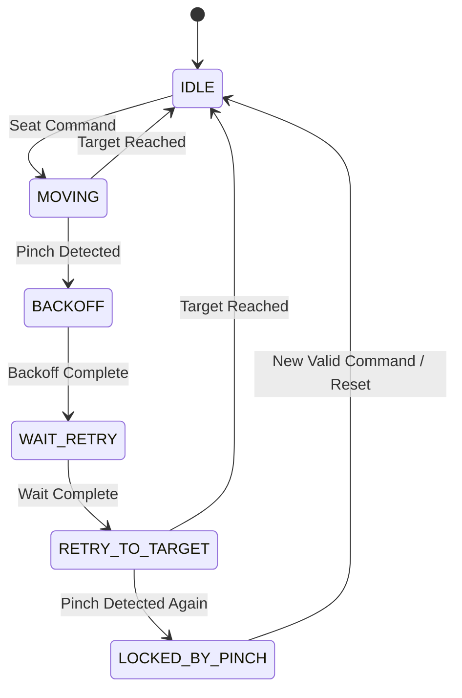

# Automotive Seat ECU

> **STM32 기반 자동차 좌석 제어 ECU 개발**  
> CAN 통신을 통해 좌석 제어 명령을 수신하고, 운전석·조수석의 Recline 및 Rotation 제어와 전류 기반 끼임 감지, 비정상 상황 대응 기능을 구현했습니다.

---

## 1. Project Overview

차량의 좌석 위치를 제어하고 안전 기능을 구현한 **자동차 좌석 제어 시스템**입니다.

Raspberry Pi 기반 메인 제어기와 각 ECU가 CAN 네트워크를 통해 통신하며,  
본 저장소는 전체 시스템 중 제가 담당한 **Front Seat ECU(STM32F103)**의 펌웨어를 중심으로 정리했습니다.

| 항목 | 내용 |
|---|---|
| 개발 기간 | 2026.06 ~ 2026.07 |
| 개발 인원 | 5명 |
| 담당 역할 | Front Seat ECU 개발 / 하드웨어 통합 및 동작 검증 |
| MCU | STM32F103CBT6 |
| Language | C |
| Framework | STM32 HAL |
| Communication | CAN 500 kbps, I2C |
| Actuator | Servo Motor, Step Motor |
| Sensor | INA226 Current Sensor |
| IDE | STM32CubeIDE |

---

## 2. My Role

### Front Seat ECU 개발

전체 프로젝트에서 **운전석·조수석을 제어하는 Front Seat ECU**를 담당했습니다.

- STM32F103 기반 Front Seat ECU 펌웨어 개발
- CAN 명령 수신 및 좌석 상태 메시지 송신
- 운전석·조수석 Recline / Rotation 독립 제어
- PWM 기반 서보모터 위치 제어
- 스텝모터 기반 좌석 회전 제어
- INA226 전류센서 기반 끼임 감지 로직 구현
- 끼임 발생 시 정지 → 후퇴 → 재시도하는 복구 상태 제어 구현
- SAFE_ABORT 수신 시 좌석 구동 즉시 정지
- 메인 제어기, 감시 노드, 각 ECU 및 구동부의 하드웨어 통합과 동작 검증

---

## 3. System Architecture

<!-- 실제 시스템 구성도 이미지를 업로드한 후 아래 경로를 수정 -->
<!-- 예: docs/system_architecture.png -->

<p align="center">
  
</p>

전체 시스템은 **메인 제어기 - CAN Network - 각 ECU**가 분산된 구조로 구성했습니다.



### Front Seat ECU의 역할

Front ECU는 CAN을 통해 운전석·조수석의 목표 각도를 전달받아 실제 구동부를 제어합니다.

- **Recline** : Servo Motor
- **Rotation** : Step Motor
- **Pinch Detection** : INA226를 이용한 서보모터 전류 측정
- **Status Feedback** : 현재 좌석 각도와 끼임 상태 CAN 송신
- **Emergency Stop** : SAFE_ABORT 수신 시 전체 좌석 구동 정지

---

## 4. Software Architecture

기능별로 모듈을 분리하고, 메인 애플리케이션에서 각 모듈을 통합하여 제어하도록 구성했습니다.



`main.c`에서는 주변장치를 초기화한 뒤 Super Loop에서 `FrontSeatApp_Process()`를 반복 실행합니다.

```c
FrontSeatApp_Init(&hi2c1);

while (1)
{
    FrontSeatApp_Process();
}
```

각 제어 모듈은 `HAL_GetTick()`을 이용하여 필요한 주기에만 동작하도록 구현해,  
긴 `HAL_Delay()`로 전체 제어 흐름이 정지하지 않도록 구성했습니다.

---

## 5. Seat Control Flow

CAN으로 좌석 목표 위치가 전달되면 명령의 유효성을 확인한 후 좌석을 제어합니다.



운전석과 조수석의 상태를 독립적으로 관리하여 각각 다른 목표 위치를 제어할 수 있도록 구성했습니다.

---

## 6. CAN Communication

Front Seat ECU는 **500 kbps CAN 통신**을 사용하여 메인 제어기 및 감시 노드와 데이터를 주고받습니다.

| CAN ID | Message | Direction | Description |
|---|---|---|---|
| `0x010` | SAFE_ABORT | RX | 비정상 상황 발생 시 좌석 긴급 정지 |
| `0x070` | GEAR_STATUS | RX | 현재 차량 기어 상태 수신 |
| `0x110` | DRIVER_SEAT_CMD | RX | 운전석 Recline / Rotation 명령 |
| `0x111` | PASSENGER_SEAT_CMD | RX | 조수석 Recline / Rotation 명령 |
| `0x210` | DRIVER_SEAT_STATUS | TX | 운전석 현재 각도 및 끼임 상태 |
| `0x211` | PASSENGER_SEAT_STATUS | TX | 조수석 현재 각도 및 끼임 상태 |

CAN 수신은 Interrupt 방식으로 처리하고,  
수신된 좌석 명령은 Queue에 저장한 뒤 Application Loop에서 처리하도록 구현했습니다.



Queue가 가득 찬 경우에는 오래된 명령을 제거하고 **최신 좌석 명령을 유지**하도록 처리했습니다.

또한 잘못된 각도 범위나 Checksum 오류가 있는 명령은 실제 구동부로 전달되지 않도록 유효성 검사를 수행합니다.

---

## 7. Motor Control

### 7.1 Recline Control

좌석 등받이 각도는 **PWM 기반 위치 제어 Servo Motor**를 이용했습니다.

목표 각도는 `0 ~ 180°` 범위로 변환하여 PWM Duty를 설정하며,  
현재 PWM 값을 목표 값으로 한 번에 변경하지 않고 일정 주기마다 조금씩 변화시켜 부드럽게 이동하도록 구현했습니다.

```text
Target Angle
     ↓
Angle → PWM 변환
     ↓
현재 PWM과 목표 PWM 비교
     ↓
일정 크기만큼 PWM 변경
     ↓
목표 각도 도달
```

### 7.2 Rotation Control

좌석 회전은 Step Motor를 이용하여 제어했습니다.

각도를 Step 수로 변환하고 현재 위치와 목표 위치를 비교하여  
한 번의 `Process()` 호출마다 필요한 방향으로 Step을 이동시키는 **Non-blocking 방식**으로 구현했습니다.

```text
Rotation Angle
      ↓
Angle → Step 변환
      ↓
현재 Step과 목표 Step 비교
      ↓
Half-Step Sequence 출력
      ↓
목표 위치 도달
```

---

## 8. Pinch Detection

좌석 구동 중 발생할 수 있는 끼임 상황을 감지하기 위해  
**INA226 전류센서로 서보모터의 전류 변화를 측정**했습니다.

단순히 특정 전류값을 한 번 초과했다고 끼임으로 판단하면 모터의 기동전류나 순간적인 부하 변화까지 오검출할 수 있기 때문에 다음 조건을 함께 고려했습니다.

### Detection Logic

```text
Servo 동작 시작
      ↓
기동전류 Ignore 구간
      ↓
20 ms 주기로 전류 측정
      ↓
순간 전류 + 연속 검출 조건
      +
이동평균 기반 전류 판단
      ↓
Pinch Detection
```

주요 적용 요소는 다음과 같습니다.

- 20 ms 간격 전류 측정
- 모터 동작 직후 기동전류 Ignore 구간 적용
- 순간적인 높은 전류를 판단하는 Hard Threshold
- 일정 시간 지속되는 부하를 판단하는 Soft Threshold
- 최근 측정값의 Moving Average 활용
- 운전석과 조수석의 부하 특성에 따라 별도의 임계값 적용
- 연속 검출 조건을 사용하여 순간적인 전류 변화에 의한 오검출 감소

---

## 9. Pinch Recovery State Machine

끼임을 감지하는 것에서 끝나지 않고,  
감지 이후 좌석을 안전하게 복구하기 위한 상태 제어를 구현했습니다.



### 끼임 발생 시 동작

```text
끼임 감지
   ↓
즉시 모터 정지
   ↓
기존 이동 방향의 반대 방향으로 30° 이동
   ↓
1초 대기
   ↓
기존 목표 위치로 1회 재시도
   ↓
재차 끼임 발생
   ↓
LOCK 상태로 전환 및 정지 유지
```

이를 위해 다음 상태를 정의했습니다.

```c
SEAT_CTRL_IDLE
SEAT_CTRL_MOVING
SEAT_CTRL_BACKOFF
SEAT_CTRL_WAIT_RETRY
SEAT_CTRL_RETRY_TO_TARGET
SEAT_CTRL_LOCKED_BY_PINCH
```

상태 기반으로 동작을 분리하여 끼임 발생 이후의 복구 과정을 명확하게 관리하도록 구성했습니다.

---

## 10. Safety Control

좌석 제어 과정에서 정상적인 명령 처리뿐 아니라 **비정상 상황에서 안전하게 정지하는 구조**를 고려했습니다.

### SAFE_ABORT

별도의 감시 노드가 메인 제어기의 상태를 감시하며,  
이상 상황 발생 시 CAN `SAFE_ABORT` 메시지를 전송합니다.

Front Seat ECU가 SAFE_ABORT를 수신하면

1. 운전석 Servo Motor 정지
2. 운전석 Step Motor 정지
3. 조수석 Servo Motor 정지
4. 조수석 Step Motor 정지
5. 진행 중이던 좌석 제어 상태 초기화

순서로 처리하여 추가적인 좌석 동작을 차단합니다.

### Gear Condition

전체 시스템에서는 차량이 **P(Parking) 상태일 때만 좌석 이동 명령을 허용**하도록 구성했습니다.

기어 상태에 따른 명령 허용 여부는 메인 제어기에서 판단하며,  
Front Seat ECU에서는 CAN을 통해 전달받은 Gear Status를 저장합니다.

---

## 11. Troubleshooting

### 11.1 전류 기반 끼임 감지 오검출

**Problem**

초기에는 일정 전류값을 초과하면 바로 끼임으로 판단했지만,  
서보모터가 움직이기 시작할 때 발생하는 기동전류와 순간적인 부하 변화 때문에 정상 동작에서도 끼임으로 판단되는 문제가 발생했습니다.

**Analysis**

정상 동작과 실제 부하 상황의 전류를 반복 측정하며

- 동작 시작 직후 전류
- 정상 이동 중 전류
- 최대 순간 전류
- 평균 전류

를 비교했습니다.

**Solution**

단일 임계값 대신

- 동작 초기 Ignore Time
- Soft / Hard Threshold
- 연속 검출 횟수
- Moving Average

를 조합해 판단하도록 변경했습니다.

또한 운전석과 조수석의 부하 특성이 달라 하나의 임계값을 공통으로 적용하지 않고 **좌석별 판단 기준을 독립적으로 설정**했습니다.

---

### 11.2 INA226 I2C Address 충돌

**Problem**

운전석과 조수석의 전류를 각각 측정하기 위해 INA226 센서 2개를 하나의 I2C Bus에 연결했지만, 동일한 기본 Address를 사용해 두 센서를 구분할 수 없는 문제가 발생했습니다.

**Solution**

센서의 Address 설정 핀을 변경하여

```text
Driver INA226     → 0x40
Passenger INA226  → 0x41
```

로 분리하고, 하나의 I2C Bus에서 두 좌석의 전류를 독립적으로 측정하도록 구성했습니다.

이 과정에서 동일한 통신 Bus에 여러 장치를 연결할 경우 **각 장치의 Address와 하드웨어 설정을 함께 확인해야 한다는 점**을 경험했습니다.

---

### 11.3 여러 기능의 동시 제어

**Problem**

CAN 통신, Servo Motor, Step Motor, 전류 측정 기능을 하나의 MCU에서 함께 처리해야 했기 때문에 특정 기능에서 긴 Delay를 사용하면 다른 기능의 처리가 함께 지연될 수 있었습니다.

**Solution**

각 모듈의 `Process()` 함수를 짧게 실행한 뒤 반환하도록 구성하고,  
`HAL_GetTick()`을 이용하여 필요한 시간 간격이 되었을 때만 각 기능을 처리하도록 변경했습니다.

```text
FrontSeatApp_Process()
        │
        ├── CAN Event Process
        ├── Servo Process
        ├── Step Process
        ├── Pinch Detect Process
        ├── Pinch Recovery Process
        └── Periodic Status TX
```

이를 통해 Bare-metal Super Loop 환경에서도 여러 기능이 서로를 장시간 Blocking하지 않고 동작하도록 구성했습니다.

---

## 12. Project Structure

```text
Core/
├── Inc/
│   ├── can.h
│   ├── front_seat_app.h
│   ├── pinchdetect.h
│   ├── servo.h
│   └── step.h
│
└── Src/
    ├── main.c
    ├── can.c
    ├── front_seat_app.c
    ├── pinchdetect.c
    ├── servo.c
    └── step.c
```

### 주요 파일

| File | Description |
|---|---|
| `main.c` | MCU 및 Peripheral 초기화, Main Super Loop |
| `front_seat_app.c` | 좌석 제어 전체 Application Logic 및 State 관리 |
| `can.c` | CAN 수신 Interrupt, Message Decode, Queue 및 Status 송신 |
| `servo.c` | 운전석·조수석 Recline Servo 제어 |
| `step.c` | 운전석·조수석 Rotation Step Motor 제어 |
| `pinchdetect.c` | INA226 전류 측정 및 끼임 감지 |

---

## 13. Demo

<!-- 시연 GIF 또는 이미지 업로드 후 수정 -->

### 좌석 제어

<p align="center">
  
</p>

### 끼임 감지 및 복구

<p align="center">
  
</p>

<!-- 영상 링크가 있다면 아래 형식 사용 -->
<!-- [▶ 전체 시연 영상 보기](영상 링크) -->

---

## 14. What I Learned

이 프로젝트를 통해 MCU에서 개별 기능을 구현하는 것뿐 아니라,  
**통신 → 상태 판단 → 구동 → 센싱 → 이상 상황 대응**이 하나의 제어 흐름으로 연결되어야 시스템이 안정적으로 동작한다는 점을 경험했습니다.

특히 여러 센서와 구동부를 실제 하드웨어에 통합하면서 소프트웨어 로직만으로는 해결되지 않는 전원, 통신, 센서 특성 및 부하 차이를 함께 고려해야 했습니다.

또한 끼임 감지 기능을 개발하면서 이론적인 임계값을 단순히 적용하는 것보다 실제 데이터를 반복 측정하고 정상 상태와 이상 상태를 비교하여 판단 기준을 조정하는 과정이 중요하다는 것을 경험했습니다.

이를 통해 **펌웨어와 하드웨어의 동작을 함께 분석하고, 시스템 전체 관점에서 문제를 해결하는 역량**을 키울 수 있었습니다.

---

## Repository Scope

본 저장소는 팀 프로젝트 전체 코드가 아닌,  
제가 담당한 **Front Seat ECU(STM32F103) 개발 내용을 중심으로 정리한 포트폴리오용 Repository**입니다.
